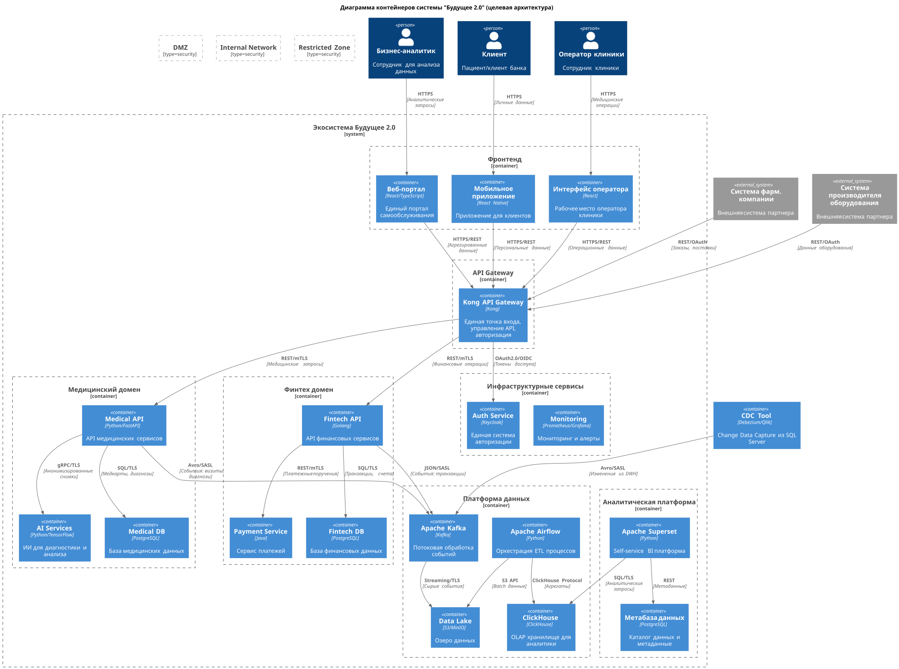
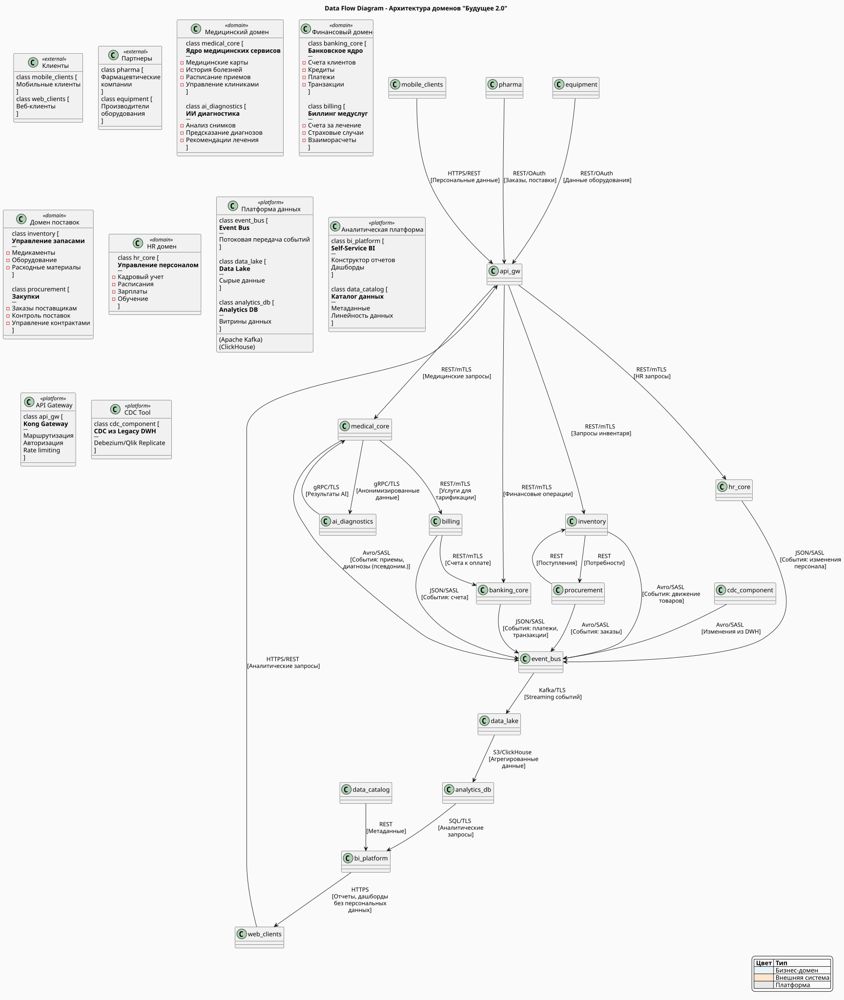

# Архитектура системы "Будущее 2.0"

Проектная работа по трансформации архитектуры компании "Будущее 2.0" - медицинского стартапа с интегрированными финансовыми услугами.

## Структура репозитория

### Task1 - Архитектурный анализ
- [`c4-containers-diagram.puml`](Task1/c4-containers-diagram.puml) - C4 диаграмма контейнеров целевой архитектуры
- [`C4_Containers.svg`](Task1/C4_Containers.svg) - Визуализация архитектуры (SVG)
- [`problems-analysis.md`](Task1/problems-analysis.md) - Анализ проблемных мест текущей системы с приоритизацией

### Task2 - Доменная декомпозиция  
- [`data-flow-diagram.puml`](Task2/data-flow-diagram.puml) - Диаграмма потоков данных между доменами
- [`DFD_Domains.svg`](Task2/DFD_Domains.svg) - Визуализация потоков данных (SVG)
- [`domain-separation-rationale.md`](Task2/domain-separation-rationale.md) - Обоснование разделения системы на домены

### Task3 - План трансформации
- [`tech-radar.md`](Task3/tech-radar.md) - Технический радар с текущими и целевыми технологиями
- [`transformation-roadmap.md`](Task3/transformation-roadmap.md) - Детальный роадмап трансформации с этапами и обоснованием

## Основные решения

### Архитектурный подход
- Переход от монолитного DWH к доменно-ориентированной архитектуре
- Event-driven взаимодействие через Apache Kafka
- Разделение OLTP и OLAP нагрузок
- Self-service BI платформа для бизнес-пользователей

### Выделенные домены
1. **Медицинский домен** - ядро медицинских сервисов и ИИ-диагностика
2. **Финансовый домен** - банковские операции и биллинг
3. **Домен поставок** - управление запасами и закупками
4. **HR домен** - управление персоналом

### Ключевые технологии
- **Платформа**: Kubernetes, Docker, Kong API Gateway
- **Данные**: Apache Kafka, ClickHouse, PostgreSQL, MinIO
- **Аналитика**: Apache Superset, Apache Airflow, dbt
- **Мониторинг**: Prometheus, Grafana, ELK Stack

## Ожидаемые результаты

- Ускорение time-to-market на 40-50%
- Повышение производительности аналитики в 10+ раз
- Возможность независимого развития бизнес-направлений
- Готовность к интеграции новых компаний
- Внедрение self-service аналитики

## Временные рамки

- **Фаза 0 (месяцы 1-2)**: Подготовка и формирование команд
- **Фаза 1 (месяцы 3-5)**: Платформа данных
- **Фаза 2 (месяцы 6-8)**: Первые домены
- **Фаза 3 (месяцы 7-9)**: Self-Service BI
- **Фаза 4 (месяцы 10-12)**: Масштабирование

## Архитектурные диаграммы

### C4 Container - Целевая архитектура

### Data Flow - Потоки данных между доменами
